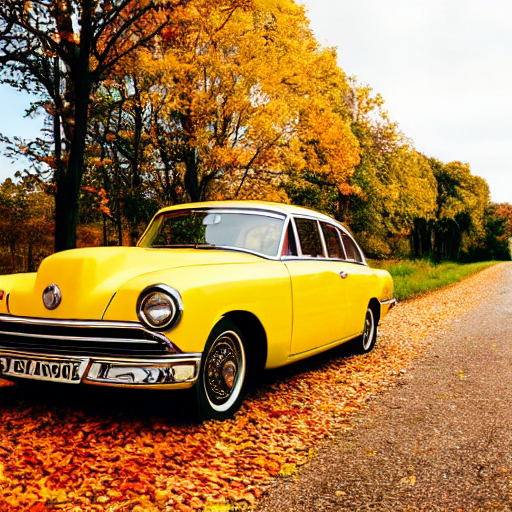

# **ImageInception Gradio Space**

Welcome to the Gradio Space for **ImageInception Gradio Space** models! This space allows you to interactively generate images from text prompts using two fine-tuned models:

- **[Stable Diffusion Finetuned](https://huggingface.co/ImageInception/stable-diffusion-finetuned)**: A specialized generative model tailored for specific domain-related image generation.
- **[T5 + ArtifyAI v1.1](https://huggingface.co/ImageInception/ArtifyAI-v1.1)**: A combination of T5 for text understanding and ArtifyAI v1.1 for producing stunning visuals from your text inputs.
- **[ImageInception/ArtifyAI v1.0](https://huggingface.co/ImageInception/ArtifyAI-v1.0)**: Fine-tuned on 5000 images from the COCO dataset, this model excels in generating highly detailed and versatile images based on text descriptions.

## **How to Use This Space**

### **1. Enter Your Text Prompt:**

Type a description of the image you want to generate. Be creative! Some example prompts include:

- "A serene beach at sunset with palm trees swaying in the breeze."
- "A bustling city street illuminated by neon lights, at night."
- "A cozy cabin in the woods surrounded by snow, with warm light shining from the windows."

### **2. Choose a Model:**

You can select between the following models:

- **[Stable Diffusion Finetuned](https://huggingface.co/ImageInception/stable-diffusion-finetuned)**: Best for generating domain-specific images like landscapes or architecture.
- **[T5 + ArtifyAI v1.1](https://huggingface.co/ImageInception/ArtifyAI-v1.1)**: Optimized for detailed and artistic visualizations based on text.
- **[ImageInception/ArtifyAI v1.0](https://huggingface.co/ImageInception/ArtifyAI-v1.0)**: Ideal for general-purpose image generation.

### **3. Generate the Image:**

Once you've entered your prompt and selected a model, hit the **"Generate"** button. The model will take your text input and transform it into a beautiful image!

### **4. Explore Creative Prompts:**

Here are some suggestions to inspire you:

- "Astronaut in a jungle with a cold color palette."
- "A futuristic city skyline with flying cars at dusk."
- "A bright yellow vintage car parked on a sunlit road, surrounded by autumn foliage."

## **Sample Outputs**

Below are examples of images generated by the models:

1. **"Two astronauts walking on the moon, 8k, detailed, creative, not realistic"**

   - 

2. **"Close-up portrait of a young woman with light skin and freckles."**

   - 

3. **"A war-torn battlefield at dawn, with burning wreckage and futuristic soldiers."**

   - 

4. **"A bright yellow vintage car parked on a road surrounded by autumn foliage."**
   - 

## **Why Use These Models?**

- **High-Quality Image Generation**: Both models have been fine-tuned to generate detailed and visually appealing images.
- **User-Friendly**: No coding required—just enter your prompt, choose a model, and generate.
- **Creative Flexibility**: Generate anything from realistic landscapes to abstract art, depending on your input.
- **Gradio-Powered Interface**: Enjoy the simplicity of interacting with powerful AI models directly from your browser.

## **Try It Now!**

Enter your text prompt and start generating stunning images!
